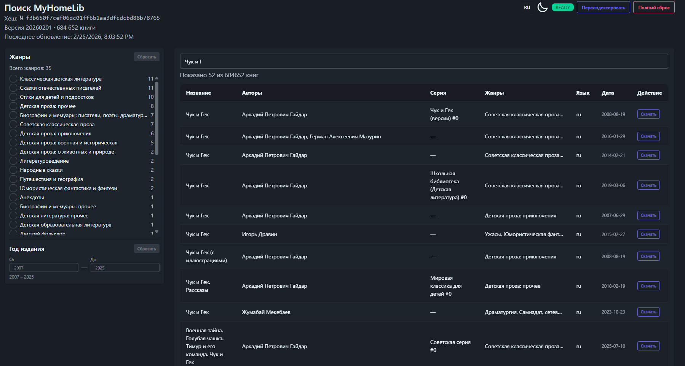

# MyHomeLib-UI



Самохостируемое веб-приложение для поиска и скачивания книг с библиотеки [Флибуста](https://flibusta.is/), распространяемой через BitTorrent.

> **English version** — [see below](#myhomelib--english)

---

## Как это работает

Библиотека Флибусты — один большой торрент (~600 ГБ), содержащий тысячи ZIP-архивов с книгами в формате FB2, а также INPX-файл с метаданными всех книг.

MyHomeLib **не скачивает весь торрент**. Вместо этого:

1. **При первом запуске** — скачивает только INPX-файл (~35 МБ) через [TorrServe](https://github.com/YouROK/TorrServer), парсит его на клиенте (Web Worker) и строит полнотекстовый поисковый индекс [MiniSearch](https://lucaong.github.io/minisearch/) прямо в браузере. Индекс сохраняется в IndexedDB — следующие открытия страницы работают мгновенно.
2. **При поиске** — запрос к MiniSearch-индексу в Web Worker (AND по всем токенам, prefix-matching, BM25-ранжирование). Результаты выдаются в реальном времени без запросов к серверу.
3. **При скачивании** — сервер через TorrServe HTTP Range запросы скачивает только нужную книгу из ZIP-архива (из каждого архива весом ~2–2,5 ГБ, загружается лишь нужный диапазон байт с книгой).

---

## Быстрый старт через Docker Compose

Самый простой способ запустить всё вместе:

```bash
git clone <репозиторий>
cd homelib-ui
docker compose up -d
```

`docker-compose.yml` поднимает два сервиса:
- **torrserve** — TorrServe на порту `8090`
- **myhomelib** — веб-приложение на порту `8080`

Откройте в браузере: [http://localhost:8080](http://localhost:8080)

Книги хранятся в именованном Docker-томе, смонтированном как `/data/books` внутри контейнера.

### Изменение настроек

Отредактируйте `docker-compose.yml` или задайте переменные окружения:

```yaml
environment:
  Library__DownloadsDirectory: /data/books          # папка для кеша INPX
  Torrent__TorrServeUrl: http://torrserve:8090      # адрес TorrServe
```

> Разделитель для вложенных ключей в переменных окружения — двойное подчёркивание (`__`).

Магнет-ссылка на торрент вводится прямо в браузере при первом открытии.

### Production Compose

Для продакшн-деплоя используйте `docker-compose.prod.yml` — порт TorrServe не пробрасывается наружу.

---

## Локальный запуск (без Docker)

### Предварительные требования

- [.NET 10 SDK](https://dotnet.microsoft.com/download)
- [Node.js 20+](https://nodejs.org/) (для сборки фронтенда)
- Запущенный TorrServe. Скачайте бинарник со страницы [релизов TorrServe](https://github.com/YouROK/TorrServer/releases) и запустите:
  ```bash
  # Linux/macOS
  ./TorrServer-linux-amd64
  # Windows
  TorrServer-windows-amd64.exe
  ```
  По умолчанию TorrServe слушает на `http://localhost:8090`.

### Сборка фронтенда

```bash
cd MyHomeLib.Ui
npm install
npm run build
```

`MyHomeLib.Web` раздаёт `MyHomeLib.Ui/dist`, если папка существует; иначе используется `MyHomeLib.Web/wwwroot`.

### Запуск бэкенда

```bash
# Отредактируйте appsettings.json (DownloadsDirectory, TorrServeUrl)
dotnet run --project MyHomeLib.Web
```

Откройте [http://localhost:5000](http://localhost:5000) (точный порт — в выводе консоли).

### Разработка фронтенда с hot-reload

```bash
cd MyHomeLib.Ui
npm run dev
```

Vite dev-сервер проксирует API-запросы на `http://localhost:5000`.

---

## Конфигурация

### Секция `Library`

| Ключ | Обязательно | По умолчанию | Описание |
|------|-------------|--------------|----------|
| `DownloadsDirectory` | Нет | `<папка приложения>` | Папка для кеша INPX (`app_data/library_cache/`) |
| `InpxPath` | Нет | — | Путь к уже скачанному `.inpx`-файлу. Если указан — торрент для индексации не используется |

### Секция `Torrent`

| Ключ | Обязательно | По умолчанию | Описание |
|------|-------------|--------------|----------|
| `TorrServeUrl` | Да | — | URL экземпляра TorrServe, например `http://127.0.0.1:8090` |

### Пример `appsettings.json`

```json
{
  "Library": {
    "DownloadsDirectory": "/data/books"
  },
  "Torrent": {
    "TorrServeUrl": "http://localhost:8090"
  }
}
```

---

## Standalone-версия (один HTML-файл)

Если вы просто хотите пользоваться библиотекой, не поднимая собственный сервер — используйте standalone-сборку.

1. Скачайте файл [`MyHomeLib.Ui/dist-standalone/index.html`](MyHomeLib.Ui/dist-standalone/index.html).
2. Откройте его в браузере (двойной клик или `file://`).
3. По умолчанию приложение подключается к публичному серверу **books.alfeg.net**.

Индекс (~545 000 книг) скачивается с публичного сервера, парсится в браузере и сохраняется в IndexedDB. Повторные открытия — мгновенные.

### Хотите использовать собственный сервер?

В форме подключения библиотеки раскройте раздел **⚙ API сервер** и введите URL вашего инстанса, например `https://my-server.example.com`. Значение сохраняется в `localStorage` браузера.

> Собственный сервер разворачивается через Docker Compose (см. ниже). Дополнительной настройки не требуется — магнет-ссылка вводится прямо в форме браузера.

---

## Первый запуск

1. Откройте браузер — вы увидите экран подключения библиотеки.
2. Введите магнет-ссылку на торрент библиотеки в появившейся форме.
3. MyHomeLib скачивает INPX-файл (~35 МБ) через TorrServe. Прогресс-бар показывает скорость загрузки (↓/↑), количество пиров и кэш-прогресс.
4. Браузер распарсит INPX и построит MiniSearch-индекс (~545 000 книг, ~30–60 сек).
5. Строка поиска становится активной.

**При повторном открытии**: INPX и индекс загружаются из IndexedDB — готово за секунды.

---

## Поиск и фильтры

- **Поиск** по названию, автору, серии, языку — AND по всем словам, prefix-matching.
- **Фильтр по жанрам** — список жанров со счётчиками в левой панели.
- **Фильтр по году** — выбор диапазона годов издания. Счётчики жанров обновляются при изменении года.

---

## Скачивание книг

1. Найдите книгу в поиске.
2. Нажмите ⬇ рядом с нужной книгой — сервер стримит книгу из TorrServe напрямую в браузер.

Ничего не сохраняется на сервере.

TorrServe загружает только те фрагменты торрента, которые содержат нужную книгу. Типичное время — несколько секунд.

---

## Использование памяти

- **Сервер** (~50–100 МБ): INPX-файл кешируется на диск; в RAM ничего не держится постоянно — только текущие запросы.
- **Браузер**: MiniSearch-индекс (~545 000 книг) хранится в IndexedDB и загружается в Web Worker. RAM браузера — ~300–500 МБ при открытом индексе.

---

## Структура проекта

```
MyHomeLibServer.slnx
├── MyHomeLib.Library/   # Модель данных книги + парсер INPX (.NET)
├── MyHomeLib.Torrent/   # Клиент TorrServe, менеджер загрузок, HTTP Range Stream (.NET)
├── MyHomeLib.Web/       # ASP.NET Core backend: API, проксирование загрузок, раздача фронтенда
└── MyHomeLib.Ui/        # Vue 3 + TypeScript + Vite SPA (поиск, фильтры, UI)
```

### Ключевые файлы

| Файл | Назначение |
|------|-----------|
| `MyHomeLib.Torrent/TorrServeClient.cs` | HTTP-обёртка над TorrServe API |
| `MyHomeLib.Torrent/HttpRangeStream.cs` | Seekable Stream поверх HTTP Range |
| `MyHomeLib.Torrent/DownloadManager.cs` | Оркестрация скачивания через TorrServe |
| `MyHomeLib.Web/LibraryService.cs` | BackgroundService — скачивает INPX и отдаёт клиенту |
| `MyHomeLib.Web/Program.cs` | Minimal API: `/api/library/inpx`, `/api/library/download`, `/api/library/status` |
| `MyHomeLib.Ui/src/workers/searchIndex.worker.ts` | MiniSearch в Web Worker: парсинг INPX, индекс, поиск, IndexedDB |
| `MyHomeLib.Ui/src/workers/inpxParser.ts` | Парсер INPX-архивов (fflate) |
| `MyHomeLib.Ui/src/composables/useLibraryState.ts` | Глобальное реактивное состояние (VueUse) |
| `MyHomeLib.Ui/src/components/GenreSidebar.vue` | Левая панель: жанры + фильтр по году |
| `Dockerfile` | Многоэтапная сборка (.NET 10 + Node.js → ASP.NET runtime, порт 8080) |
| `docker-compose.yml` | TorrServe + MyHomeLib с общими named volumes |

---

## Лицензия

[MIT](LICENSE)

---

---

# MyHomeLib-UI — English

A self-hosted web application for searching and downloading books from the [Flibusta](https://flibusta.is/) e-book library distributed as a BitTorrent.

## How it works

The Flibusta library is a single large torrent (~600 GB) containing thousands of ZIP archives with FB2 books and an INPX index file with metadata for all books.

MyHomeLib **never downloads the full torrent**. Instead:

1. **On first load** — downloads only the INPX index (~35 MB) via [TorrServe](https://github.com/YouROK/TorrServer), parses it in the browser (Web Worker), and builds a [MiniSearch](https://lucaong.github.io/minisearch/) full-text index stored in IndexedDB. Subsequent visits restore the index instantly from cache.
2. **On search** — queries MiniSearch in the Web Worker (AND across all tokens, prefix matching, BM25). Results appear in real time with no server round-trips.
3. **On download** — the server streams only the needed bytes from a ZIP archive (~2–2.5 GB each) via TorrServe HTTP Range requests, fetching just the one book.

---

## Standalone build (single HTML file)

The easiest way to start — no installation or server required.

1. Download [`MyHomeLib.Ui/dist-standalone/index.html`](MyHomeLib.Ui/dist-standalone/index.html).
2. Open it in any browser (double-click or `file://`).
3. By default it connects to the public server **books.alfeg.net**.

The index (~545 000 books) is downloaded from the public server, parsed in the browser, and cached in IndexedDB. Repeat visits are instant.

### Using your own server

On the library connection screen expand **⚙ API Server** and enter your instance URL, e.g. `https://my-server.example.com`. The value is saved in `localStorage`.

> Your server is deployed via Docker Compose (see below). No extra config needed — the magnet URI is entered directly in the browser.

---

## Quick start with Docker Compose

```bash
git clone <repo>
cd homelib-ui
docker compose up -d
```

This starts:
- **torrserve** — TorrServe on port `8090`
- **myhomelib** — web app on port `8080`

Open [http://localhost:8080](http://localhost:8080) in your browser.

The INPX cache is stored in a named Docker volume mounted at `/data/books`.

### Customising settings

Edit `docker-compose.yml` or set environment variables:

```yaml
environment:
  Library__DownloadsDirectory: /data/books
  Torrent__TorrServeUrl: http://torrserve:8090
```

> Nested config keys use double-underscore as separator in environment variables.

The magnet URI is entered directly in the browser on first use.

### Production Compose

Use `docker-compose.prod.yml` for production — TorrServe port is not exposed externally.

---

## Running locally (without Docker)

### Prerequisites

- [.NET 10 SDK](https://dotnet.microsoft.com/download)
- [Node.js 20+](https://nodejs.org/)
- TorrServe running on `http://localhost:8090` — download a binary from the [TorrServe releases](https://github.com/YouROK/TorrServer/releases)

### Build the frontend

```bash
cd MyHomeLib.Ui
npm install
npm run build
```

`MyHomeLib.Web` serves `MyHomeLib.Ui/dist` when it exists; otherwise it falls back to `MyHomeLib.Web/wwwroot`.

### Run the backend

```bash
# Edit appsettings.json first (set DownloadsDirectory, TorrServeUrl)
dotnet run --project MyHomeLib.Web
```

Open [http://localhost:5000](http://localhost:5000) (check console output for the exact port).

On first run the app downloads the INPX index via TorrServe, then the browser parses and indexes all books. A status bar shows live progress. Subsequent visits are instant.

### Frontend development with hot-reload

```bash
cd MyHomeLib.Ui
npm run dev
```

The Vite dev server proxies API requests to `http://localhost:5000`.

---

## Configuration

### `Library` section

| Key | Required | Default | Description |
|-----|----------|---------|-------------|
| `DownloadsDirectory` | No | `<app folder>` | Folder for the INPX cache (`app_data/library_cache/`) |
| `InpxPath` | No | — | Path to a pre-downloaded `.inpx` file. When set, the torrent is not needed for indexing |

### `Torrent` section

| Key | Required | Default | Description |
|-----|----------|---------|-------------|
| `TorrServeUrl` | Yes | — | URL of the TorrServe instance, e.g. `http://torrserve:8090` |

### Example `appsettings.json`

```json
{
  "Library": {
    "DownloadsDirectory": "/data/books"
  },
  "Torrent": {
    "TorrServeUrl": "http://localhost:8090"
  }
}
```

---

## Memory usage

- **Server** (~50–100 MB): the INPX file is cached to disk; nothing is kept in RAM permanently beyond the current request.
- **Browser**: MiniSearch index (~545 000 books) lives in IndexedDB and is loaded into a Web Worker. Expect ~300–500 MB browser RAM while the index is active.

---

## Project structure

```
MyHomeLibServer.slnx
├── MyHomeLib.Library/   # Book data model + INPX parser (.NET)
├── MyHomeLib.Torrent/   # TorrServe client, download manager, HTTP Range Stream (.NET)
├── MyHomeLib.Web/       # ASP.NET Core backend: API, download proxy, frontend serving
└── MyHomeLib.Ui/        # Vue 3 + TypeScript + Vite SPA (search, filters, UI)
```

### Key files

| File | Purpose |
|------|---------|
| `MyHomeLib.Torrent/TorrServeClient.cs` | HTTP wrapper for TorrServe API |
| `MyHomeLib.Torrent/HttpRangeStream.cs` | Seekable `Stream` backed by HTTP Range — lets `ZipArchive` read a remote ZIP without downloading all of it |
| `MyHomeLib.Torrent/DownloadManager.cs` | Orchestrates book search and download via TorrServe |
| `MyHomeLib.Web/LibraryService.cs` | BackgroundService — downloads the INPX and serves it to the client |
| `MyHomeLib.Web/Program.cs` | Minimal API: `/api/library/inpx`, `/api/library/download`, `/api/library/status` |
| `MyHomeLib.Ui/src/workers/searchIndex.worker.ts` | MiniSearch in a Web Worker: parse INPX, build index, search, IndexedDB persistence |
| `MyHomeLib.Ui/src/workers/inpxParser.ts` | INPX archive parser (fflate + streaming) |
| `MyHomeLib.Ui/src/composables/useLibraryState.ts` | Global reactive state (VueUse createGlobalState) |
| `MyHomeLib.Ui/src/components/GenreSidebar.vue` | Left sidebar: genre list + year range filter |
| `Dockerfile` | Multi-stage build: .NET 10 SDK + Node.js → ASP.NET runtime, port 8080 |
| `docker-compose.yml` | Starts TorrServe + MyHomeLib with shared named volumes |

---

## License

[MIT](LICENSE)
